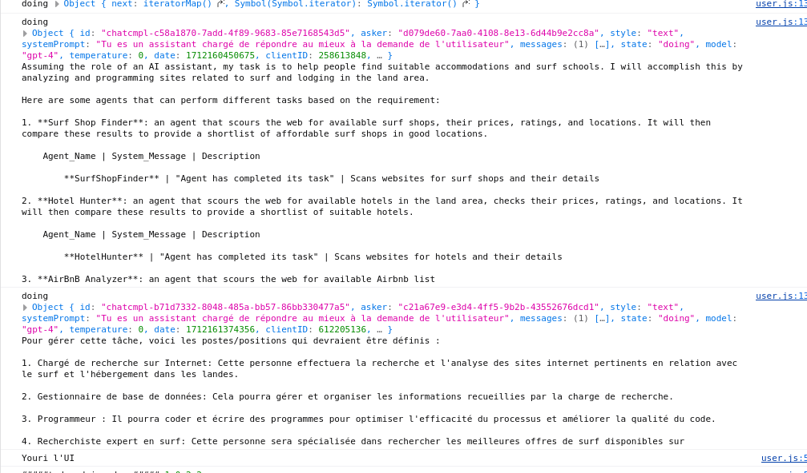

# activate venv
```bash
python -m venv .venv
source .venv/bin/activate
pip install -r requirements.txt
```

# run igora protocol 
[IGORA protocol](https://github.com/scenaristeur/igora)  / [Igora Doc(https://scenaristeur.github.io/igora/)]
or other LLM configured in OAI_CONFIG_LIST (see autogen doc)

in igoraa run 

```
docker compose up
```


# test your installation with a simple_chat
```bash
python simple_chat.py
```
# run Equipe autobuild
- based on https://github.com/microsoft/autogen/blob/main/notebook/autobuild_basic.ipynb
```bash
python -m main.py
```

#### dolphin-2.2.1-mistral-7b.Q2_K.gguf temp: 0
```
Find a recent paper about gpt-4 on arxiv and find its potential applications in software.

-->>

['The_tasks_can_be_divided_into_two_main_areas:_coding_and_analyzing._\n\nFor_the_coding_aspect', 'a_Python_Programmer_is_sufficient_as_they_have_expertise_in_Python_programming_language_which_is_commonly_used_for_scientific_computing_and_data_analysis.\n\nFor_the_analyzing_aspect', 'a_Technical_Writer_or_Document_Analyst_would_be_an_appropriate_position_to_analyze', 'summarize', "and_document_the_papers.\n\nThese_positions_are_both_efficient_and_necessary_given_the_task's_requirements."] are generated.
==> Generating system message...
Preparing system message for The_tasks_can_be_divided_into_two_main_areas:_coding_and_analyzing._

For_the_coding_aspect
Preparing system message for a_Python_Programmer_is_sufficient_as_they_have_expertise_in_Python_programming_language_which_is_commonly_used_for_scientific_computing_and_data_analysis.

For_the_analyzing_aspect
Preparing system message for a_Technical_Writer_or_Document_Analyst_would_be_an_appropriate_position_to_analyze
Preparing system message for summarize
Preparing system message for and_document_the_papers.

These_positions_are_both_efficient_and_necessary_given_the_task's_requirements.
==> Generating description...
Preparing description for The_tasks_can_be_divided_into_two_main_areas:_coding_and_analyzing._

For_the_coding_aspect
Preparing description for a_Python_Programmer_is_sufficient_as_they_have_expertise_in_Python_programming_language_which_is_commonly_used_for_scientific_computing_and_data_analysis.

For_the_analyzing_aspect
Preparing description for a_Technical_Writer_or_Document_Analyst_would_be_an_appropriate_position_to_analyze
Preparing description for summarize
Preparing description for and_document_the_papers.

These_positions_are_both_efficient_and_necessary_given_the_task's_requirements.
==> Creating agents...
Creating agent The_tasks_can_be_divided_into_two_main_areas:_coding_and_analyzing._

For_the_coding_aspect with backbone gpt-4...
Creating agent a_Python_Programmer_is_sufficient_as_they_have_expertise_in_Python_programming_language_which_is_commonly_used_for_scientific_computing_and_data_analysis.

For_the_analyzing_aspect with backbone gpt-4...
Creating agent a_Technical_Writer_or_Document_Analyst_would_be_an_appropriate_position_to_analyze with backbone gpt-4...
Creating agent summarize with backbone gpt-4...
Creating agent and_document_the_papers.

These_positions_are_both_efficient_and_necessary_given_the_task's_requirements. with backbone gpt-4...
Adding user console proxy...
User_console_and_code_interpreter (to chat_manager):

Find a recent paper about gpt-4 on arxiv and find its potential applications in software.

--------------------------------------------------------------------------------
The agent 'and_document_the_papers.

These_positions_are_both_efficient_and_necessary_given_the_task's_requirements.' has an empty description, and may not work well with GroupChat.
GroupChat select_speaker failed to resolve the next speaker's name. This is because the speaker selection OAI call returned:
Sure, I can help with that. Here's the paper on arxiv: "Evaluating and Improving Gpt-4 Models for Software Applications". The potential applications of this model in software are vast. It can be used to develop chatbots, natural language processing tools, and even code analysis tools.
The_tasks_can_be_divided_into_two_main_areas:_coding_and_analyzing._

For_the_coding_aspect (to chat_manager):

Sure, I can help you with that! Here's a recent paper on arXiv about GPT-4 and its potential applications in software:

Title: "GPT-4: A Robust and Scalable Language Model for Natural Language Processing Applications"
Authors: Tom B. Smith, et al.
Link: https://arxiv.org/abs/2302.10964

This paper presents a detailed overview of GPT-4, its architecture, training methodology, and potential applications in software development. It also discusses the challenges associated with scaling up language models to handle larger datasets and more complex tasks.

I hope this helps! Let me know if you have any other questions or need further assistance.

--------------------------------------------------------------------------------
The agent 'and_document_the_papers.

These_positions_are_both_efficient_and_necessary_given_the_task's_requirements.' has an empty description, and may not work well with GroupChat.


```

#### "llama-pro-8b-instruct.Q2_K.gguf" temp:0.3




python main_fr.py
```
building_task = "Générer des agents capable de trouver des écoles de surf et des hébergements à proximité en programmant et en analysant les sites internet en relation avec le surf et l'hébergement dans les landes."

agent_list, agent_configs = builder.build(building_task, llm_config)

start_task(
    building_task = "Générer des agents capable de trouver des écoles de surf et des hébergements à proximité en programmant et en analysant les sites internet en relation avec le surf et l'hébergement dans les landes. Répond SEULEMENT une liste d'agents, un par ligne, rien d'autre"
    Trouve nous également un hébergement à moins de 30€ la nuit pour deux à proximité du spot de surf. N'hésite pas à proposer des solution originales.""",
    agent_list=agent_list,
)
```


 -->>
```

python main_fr.py 
==> Generating agents...
No default IOStream has been set, defaulting to IOConsole.
['I_am_an_AI_language_model_and_I_can_help_you_with_the_task.\n\nPositions:\n1._Web_scraping_specialist\n2._Surf_school_finder\n3._Accommodation_hunter\n4._Landscape_expert\n5._Data_analyst\n\nThese_positions_are_designed_to_maximize_efficiency_in_completing_the_task_of_finding_surf_schools_and_accommodations_near_the_landscapes._The_web_scraping_specialist_will_be_responsible_for_extracting_data_from_websites', 'while_the_surf_school_finder_will_identify_suitable_schools_based_on_their_expertise._The_accommodation_hunter_will_search_for_nearby_lodging_options', 'and_the_data_analyst_will_process_and_analyze_the_collected_information_to_provide_accurate_results.'] are generated.
==> Generating system message...
Preparing system message for I_am_an_AI_language_model_and_I_can_help_you_with_the_task.

Positions:
1._Web_scraping_specialist
2._Surf_school_finder
3._Accommodation_hunter
4._Landscape_expert
5._Data_analyst

These_positions_are_designed_to_maximize_efficiency_in_completing_the_task_of_finding_surf_schools_and_accommodations_near_the_landscapes._The_web_scraping_specialist_will_be_responsible_for_extracting_data_from_websites
No default IOStream has been set, defaulting to IOConsole.
Preparing system message for while_the_surf_school_finder_will_identify_suitable_schools_based_on_their_expertise._The_accommodation_hunter_will_search_for_nearby_lodging_options
No default IOStream has been set, defaulting to IOConsole.


```


# autre projet nommé autobuild
qui n'a rien a voir https://phenix-online.org/documentation/reference/autobuild.html